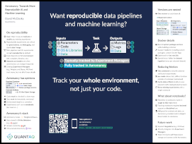

# Aeromancy at SciPy 2024

Aeromancy has been accepted at [SciPy 2024](https://www.scipy2024.scipy.org/),
July 8-14, 2024.

## Poster

## Abstract

We present Aeromancy, an opinionated philosophy and open-sourced framework that
closely tracks experimental runtime environments for more reproducible machine
learning. In existing experiment trackers, it’s easy to miss important details
about how an experiment was run, e.g., which version of a dataset was used as
input or the exact versions of library dependencies. Missing these details can
make replicability more difficult. Aeromancy aims to make this process smoother
by providing both new infrastructure (a more comprehensive versioning scheme
including both system runtimes and external datasets) and a corresponding set of
best practices to ensure experiments are maximally trackable.

## Description

Machine learning experiments are not reproducible by default. Each experiment is
a function of several complex inputs, including experiment configuration (e.g.,
hyperparameters, command-line flags), the runtime environment at execution time
(e.g., code and libraries), and potentially large external datasets. Determining
reproducible encodings for all inputs can be difficult and tracking them adds
considerable development friction.

Most experiment management systems (e.g., MLFlow and Weights and Biases) track
core experimental information (input parameters, metrics, and logs), but may
require some discipline and additional infrastructure to ensure reproducibility.
For example, some track the current Git commit but don’t block uncommitted
changes allowing for the tracked results to diverge from the tracked code. Few
track external dependencies such as non-Python system packages. These may be
difficult to reproduce as compilation/installation inevitably gets harder.
Tracking large datasets, especially for mutable datasets, is tricky and often
left unaddressed by experiment management systems.

We present Aeromancy, an opinionated philosophy and an open-sourced framework
for performing reproducible AI and ML. Aeromancy is not an experiment tracker on
its own, instead extending an existing experiment tracker (Weights and Biases)
with a comprehensive versioning system. In Weights and Biases, each experiment
can be associated with a Git commit, so our first aim is to track as much as
possible in Git history and then take special care to track external artifacts
such as input and output datasets. We require that each experiment be run in a
pristine Git workspace (i.e., no untracked changes) so each commit will
precisely describe the code and its Python project dependencies. To capture
runtime environment information, we require all experiments to be run inside a
Docker container (where the image configuration is also captured in the commit).
By running experiments in a container, Aeromancy eliminates uncertainty around
which environment a given experiment ran in, reducing the chance for bitrot.
Lastly, we use a versioned blob store (e.g., Amazon S3) to specify input and
output datasets which makes their lineage clear, even when there are many
versions.

Many opinionated frameworks accept development friction as a necessary tradeoff.
Aeromancy includes several features to improve the developer experience. Since
running in containers slows development, Aeromancy includes a development mode
where experiments aren’t tracked but code can be tested and debugged rapidly.
Aeromancy also includes a versioned blob store cache to avoid unnecessary
network transfers. For building processing pipelines, Aeromancy includes a
simple framework for composing tasks, each of which will be tracked as a
separate experiment with dependencies recorded.

We’ll end with a set of known limitations. While complete reproducibility is
often not feasible due to various possible sources of non-determinism, some can
be stabilized through best practices (e.g., not relying on hash or file system
orderings, always seeding random number generators). Others (for example,
computations across multiple threads, processes, or systems) can be identified
as a potential source of experimental noise.
